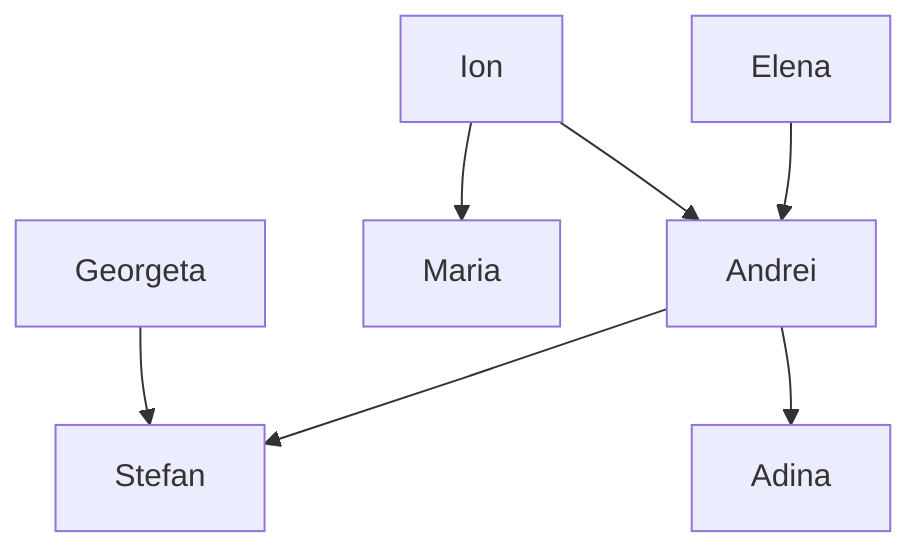
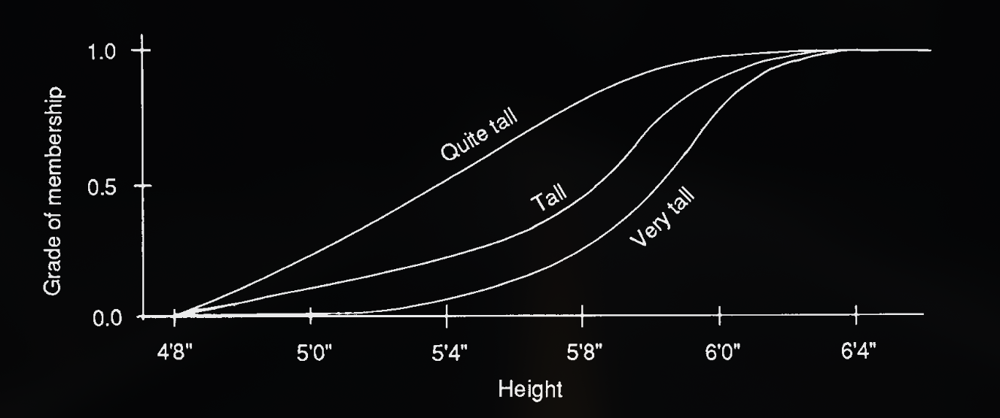
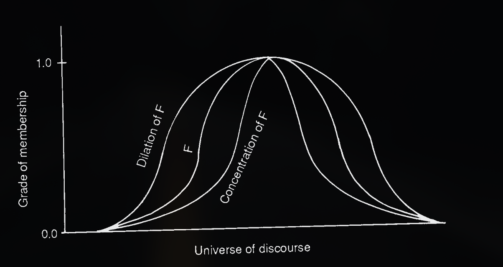
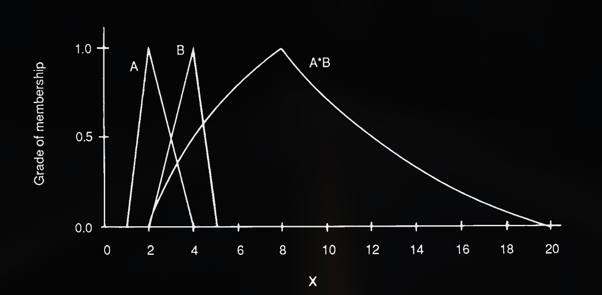
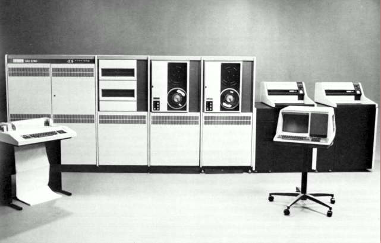
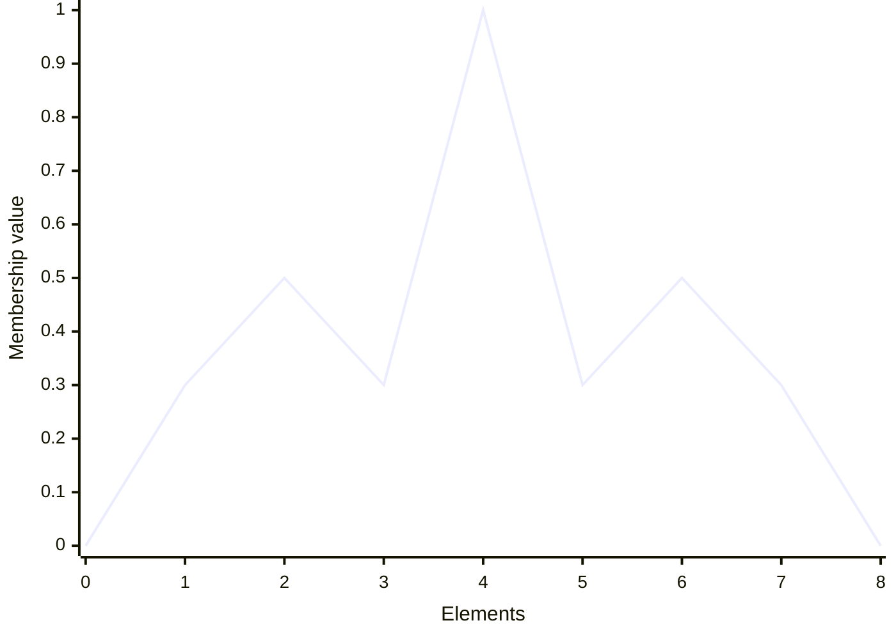

# Table of Contents

<!--incremental_lists: true-->

- Summary
- A Brief Introduction to Expert Systems
- Heuristics and Inexact Knowledge
- Approaches to Uncertainty
- System Z-II's approach to vagueness
- System Z-II's architecture
- Working example

---

# Summary

## _Fuzzy Concepts in Expert Systems_

**Authors:** by K. S. Leung and W. Lan, both from the Chinese University of Hong
Kong (CUHK)

**Published:** September 1988

**Subject:** An implementation of Fuzzy Logic to design an Expert System better
equipped to deal with representations of inexact knowledge present in natural
language.

<!--pause-->

### Keywords

Fuzzy Logic, Artificial Intelligence, Systems engineering

---

# A Brief Introduction to Expert Systems (ES)


> Source: Internet meme from Iron Men 2

<!--speaker_note:A primitive form of Artificial Intelligence (AI) system, among the first to be
considered to be a successful emulation of the decision-making ability of a
human expert.

An adequate solution, considering severe bottlenecks to processing power and data availability.-->

---

## Core components of ESs

<!--pause-->

### Knowledge base

A collection of stored assertions, or `facts about the world`.

<!--pause-->

### Inference engine

An Automated reasoning system to evaluate conclusions given the current state of
the knowledge base and the recursive application of relevant
`rules of
inference`.

<!--pause-->

- Rules of inference are glorified `if/then` statements.

- Two main modes of operation: **forwards** and **backwards chaining**.

> Leung and Lan's solution make use of **backwards chaining**.

---

## An example

<!-- column_layout: [1, 1] -->

<!-- column: 0 -->

### Family tree diagram



<!-- column: 1 -->

<!-- pause -->

### Prolog code

```prolog
% --- Facts (The Database) ---
% parent(Parent, Child)
parent(ion, andrei).
parent(elena, andrei).
parent(ion, maria).

parent(andrei, stefan).
parent(andrei, adina).
parent(georgeta, stefan).

% --- Rules (The Logic) ---
% A is a grandparent of B if A is a parent of C, and C is a parent of B.
grandparent(GP, GC) :-
    parent(GP, Parent),
    parent(Parent, GC).

:- initialization(main).
```

<!-- reset_layout -->

---

## An example

<!-- column_layout: [1, 1] -->

<!-- column: 0 -->

### Querying

```prolog
main :-
    format('~n--- Query 1: grandparent(X, stefan) ---~n'),
    grandparent(X, stefan),
    format('X = ~w~n', [X]),
    fail.
main :-
    format('~n--- Query 2: grandparent(ion, X) ---~n'),
    grandparent(ion, X),
    format('X = ~w~n', [X]),
    fail.
main :-
    format('~n--- Query 3: grandparent(GP, GC) ---~n'),
    grandparent(GP, GC),
    format('GP = ~w, GC = ~w~n', [GP, GC]),
    fail.
main :-
    halt.
```

<!-- column: 1 -->

<!-- pause -->

### Results

```bash +exec_replace
echo "Execution time: $(date)"
swipl family.pl
```

<!-- reset_layout -->

---

## Accessory components of ESs

Not strictly necessary, but _very much required_ in real world applications:

<!-- pause -->

- Knowledge Acquisition and Truth Maintenance utilities,

<!-- pause -->

- User Interface and Hypothetical Reasoning utilities,

<!--pause-->

- Ontology classification, and _finally_,

<!-- pause -->

- **Uncertainty Systems** (i.e.: the crux of System Z-II)

---

# Heuristics and inexact knowledge

Much of human knowledge is **inexact** and, therefore, **cannot be represented
with first-order logic statements**.

<!--pause-->

## Heuristics

Approximate solutions operating on incomplete or imperfect information.

For that the authors identify two sources of inexact knowledge:

---

## Uncertainty

The system is unsure about a given predicate. Example using a Confidence Factor
(CF):

```pascal
rule:
    IF X is a bird,
    THEN it can fly. (CF = 0.9)

fact:
    X is a bird. (CF = 0.8)

conclusion:
    X can fly. (CF = 0.9 ✕ 0.8 = 0.72)
```

---

## Vagueness (fuzzy concepts)

The system is unsure about the `boundaries` of a given predicate. Example:

```pascal
rule:
    IF
        (body is well-built OR height is tall)
        AND person is healthy
    THEN
        weight is heavy
```

Vagueness is subject to the `Soristes Paradox` (a.k.a. the _Heap Paradox_)

---

## Interactions between uncertainty and vagueness

Previous ESs, such as `Cadiag-2`, had some capability to deal with fuzzy
concepts. System Z-II excels at it by also being able to deal with:

<!--pause-->

### Uncertainty about vagueness or vagueness about uncertainty

```pascal
rule:
    IF
        (body is well-built OR height is tall)
        AND person is healthy
    THEN
        weight is heavy
    WITH
        CERTAINTY -> close to 0.8
```

<!--pause-->

### Vagueness about vagueness

Statements such as "John is `very` `tall`" or "John is `quite` `tall`".

---

# Approaches to uncertainty

<!--pause-->

## Conditional probability

Methods such as the `Bayesian Inference` and the
`Dempster-Shafer Theory of Evidence`.

- Empirical methods, often associated with Machine Learning Algorithms

- Require massive amounts of parameterized data in order to be effective.

<!--pause-->

## Confidence Factors

Assigning certainty based on the opinions of experts.

> This was the approach taken by System Z-II

---

# System Z-II's approach to vagueness

## Fuzzy sets with adverbs as arithmetic modifiers

Take the following example for the fuzzy concept `tall` represented as a set
with different degrees of membership ranging from 0.0 to 1.0.

### Tall membership values for different heights and use of adverbs

| Height  | No adverb | quite (square root) | very (squared) |
| :------ | :-------- | :------------------ | :------------- |
| <= 4'8" | 0.0       | 0.0                 | 0.0            |
| 5'0"    | 0.1       | 0.31                | 0.01           |
| 5'4"    | 0.2       | 0.44                | 0.04           |
| 5'8"    | 0.7       | 0.83                | 0.49           |
| 6'0"    | 0.9       | 0.94                | 0.81           |
| >= 6'4" | 1.0       | 1.0                 | 1.0            |

---

### Tall membership values for different heights and use of adverbs



> Source: from the paper

---

## Relationships between fuzzy data and non-fuzzy consequents

Consider the following rule and fact:

```pascal
rule:
    IF X is tall,
    THEN X should be chosen as a member of the basketball team.
    (CF_1 = 1.0)
fact:
    Stefan is quite tall
    (CF_2 = 1.0)
conclusion:
    Stefan should be chosen as a member of the basketball team.
    (CF_3 = y)
```

> Which value should `y` have?

---

### Similarity

For Leung and Lan, the CF for the conclusion should be the product between the
rule and fact CFs and a `Similarity (M)` factor:

```latex +render +width:30%
\[ CF_3 = CF_1 \cdot CF_2 \cdot M \]
```

<!--pause-->

In turn, Similarity is calculated using the following algorithm:

```pascal
IF N(F̅|F') > 0.5
THEN M = P(F|F')
ELSE M = (N(F̅|F') + 0.5) * P(F|F')
```

Where `N` is the `Necessity` and `P` is the `Possibility`, for the fuzzy sets
`F` and `F'` being matched.

---

#### Possibility

<!-- column_layout: [1, 2] -->

<!--column: 0-->

The maximum degree of intersection between two sets, expressed as

```latex +render
\[ P(F|F′)=\underset{w}{\max}(\min (\mu_F(w), \mu_{F′}(w))) \]
```

<!--column: 1-->

<!--pause-->


> The "quite tall" meets the "tall" at 6'4" at its peak and, therefore, has a
> possibility of 1.0

---

#### Necessity

<!-- column_layout: [1, 2] -->

<!--column: 0-->

The degree in which the data meets the pattern exactly, expressed as

```latex +render
\[ N(F|F') = 1 - P(\overline F| F')\]
```

Where F̅ is the complement of F.

`N(F|F') > 0.5` -> F' is a concentration of F.

`N(F|F') = 0.5` -> F' is a duplicate of F.

`N(F|F') < 0.5` -> F' is a dilation of F.

<!--column: 1-->



> **Source:** original paper

---

### Similarity

So, the confidence with which System Z-II can assert that Stefan should be
chosen as a member of the basketball team is:

P = 1.0

N = 1 - P(F̅|F') = 0.3

N < 0.5 -> M = (N(F̅|F') + 0.5) ✕ P(F|F') = (0.3 + 0.5) ✕ 1.0 = 0.8 ⯀

---

## Relationships between fuzzy data and fuzzy consequents

Consider this simple rule:

```pascal
IF price is high, THEN profit is good
```

Such a rule requires the user to describe a couple of fuzzy sets and a rule
relating those.

---

### Knowledge acquisition

During the knowledge acquisition phase, the user can create the fuzzy sets and
have them be related automatically using one of the three following rules (R_SG
is the default):

```latex +render +width:60%
\[ R_{SG} = (F_1 \times V \rightarrow_S U \times F_2) \land (\overline F \times V \rightarrow_G U \times \overline F_2) \]

\[ R_S = F_1 \times V \rightarrow_S U \times F_2 \]

\[ R_G = F_1 \times V \rightarrow_G U \times F_2 \]
```

Where:

- `V` and `U` are the Universes of Discourse for `F_1` and `F_2` respectively.
- `✕` is the Cartesian Product operator.
- `->_S` and `->_G` are the Standard and Gödelian variations of the Fuzzy
  Inference, respectively.

---

### Consultation (inference)

During consultation, the conclusion `C` to the aforementioned rule can be
expressed as their `fuzzy composition`:

```latex +render +width:60%
\[ \mu_C (x) = \underset{w}{\max}(\min (\mu_{F_1}(w) \mu_{F_2}(w, x)))\]
```

When applied, such a rule should map `high price` to `good profit`.

---

## Calculating fuzzy confidence

Consider the existence of a given rule and a given fact such that:

```pascal
rule: IF A is V_1 THEN C is V_2 (FN_1)
fact: A is V_1                  (FN_2)
conclusion: C is V_2            (FN_3)
```

Let `(FN_X)` be fuzzy confidence values such as "close to 1.0".

<!--pause-->

Then the fuzzy confidence in the conclusion `C`, described by `FN_3`, is
obtained though the process of `fuzzy number multiplication`:

```latex +render
\[ \mu_{F_3} (z) = \underset{z = x \times y}{\max}(\min(\mu_{F_1}(x),\mu_{F_2}(y)))\]
```

---



> Fuzzy number multiplication. source: original paper

As a result, "close to 2" and "close to 4" would map to "around 8". As 8 is the
center of gravity, and "around" an adverb used to express the larger value
spread.

---

## Rules with multiple fuzzy propositions

<!-- column_layout: [2, 1] -->

<!--column: 0-->

```pascal
rule:
    IF
        (body is well-built OR height is tall)
        AND person is healthy
    THEN
        weight is heavy
    WITH
        CERTAINTY -> close to 0.8
```

<!--column: 1-->

<!--pause-->

`AND` -> Fuzzy Union

```latex +render
\[ \mu_U(x) = \min(\mu_{F_1}(x), \mu_{F2}(x)) \]
```

<!--pause-->

`OR` -> Fuzzy Intersection

```latex +render
\[ \mu_I(x) = \max(\mu_{F_1}(x), \mu_{F2}(x)) \]
```

> Fuzzy intersection is also used when multiple fuzzy rules corroborate with the
> same conclusion.

---

# System Z-II's architecture

<!-- column_layout: [2, 1] -->

<!--column: 0-->



> Source: Computer Architecture Webpage at Keio University

<!--column: 1-->

System Z-II was designed to operate in a **VAX-11/708** microcomputer.

<!--pause-->

At its _most basic description_ is composed by three interacting subsystems:

1. Knowledge acquisition
2. Consultation driver
3. Fuzzy knowledge base

<!--speaker_note: The implementation of the Fuzzy knowledge base was done in VAX-Lisp, all the other modules were implemented in VAX-Pascal for greater execution speed.-->

---

## Modules overview

```file +render
path: ./diagrams/1.mmd
language: mermaid
```

> **Legend:** \- \- -> : Data flow | --> : Control flow

---

### Fuzzy Knowledge Base

<!-- column_layout: [2, 1] -->

<!--column: 0-->

```file +render
path: ./diagrams/11.mmd
language: mermaid
```

<!--column: 1-->

Stores the fuzzy terms and sets as hash tables and property lists.

---

### Objects Management Module

<!-- column_layout: [2, 1] -->

<!--column: 0-->

```file +render
path: ./diagrams/2.mmd
language: mermaid
```

<!--column: 1-->

Creates, modifies and deletes objects in the system. Objects are named data
structures endowed with attributes.

> Think in terms of Object Oriented Programming (OOP).

<!-- reset_layout -->

---

#### Predefined attributes

| Attribute        | Type        | Contents                                                  |
| :--------------- | :---------- | :-------------------------------------------------------- |
| TYPE             | String      | Sets the object's type                                    |
| FUZZY-OR-NOT     | Boolean     | Indicates if values stored are fuzzy                      |
| ASK-FIRST-OR-NOT | Boolean     | Indicates if the user should be asked the object's values |
| USED-BY-RULES    | \[ Rules \] | Rules that contain this object as an `antecedent`         |
| UPDATED-BY-RULES | \[ Rules \] | Rules that contain this object as an `consequent`         |

---

### Fuzzy Terms Management Module

<!-- column_layout: [2, 1] -->

<!--column: 0-->

```file +render
path: ./diagrams/3.mmd
language: mermaid
```

<!--column: 1-->

Creates and maps the existing `fuzzy sets`, associated with the fuzzy terms
(i.e. "very tall", "rather good") seen in objects where `FUZZY-OR-NOT` is
`True`.

---

#### Fuzzy Sets

<!-- column_layout: [1, 1] -->

<!--column: 0-->

Fuzzy sets are implemented as lists of numbers that satisfy the conditions of
`normality` and `convexity`.

<!--pause-->

- A fuzzy set `A` is said to be `normal` when _at least one of its elements_ `x`
  has a membership grade of `1.0`.

<!--pause-->

- A fuzzy set `A` is said to be `convex` when, for all values `x`, the
  membership function `μ(x)` does not "dip and then rise again".

<!--column: 1-->



> Non-convex fuzzy set example

---

### Facts Management Module

<!-- column_layout: [2, 1] -->

<!--column: 0-->

```file +render
path: ./diagrams/4.mmd
language: mermaid
```

<!--column: 1-->

Creates and manages facts (assertions). Facts are established by the user
through the use of restricted English sentences, either of his own initiative or
when prompted by the system when more information is required.

<!-- reset_layout -->

---

### Rules Management Module

<!-- column_layout: [2, 1] -->

<!--column: 0-->

```file +render
path: ./diagrams/5.mmd
language: mermaid
```

<!--column: 1-->

Creates and manages facts (assertions). Facts are established by the user
through the use of restricted English sentences, either of his own initiative or
by being prompted by the system in a step-by-step manner when such information
is required.

<!-- reset_layout -->

---

### System Properties Management Module

<!-- column_layout: [2, 1] -->

<!--column: 0-->

```file +render
path: ./diagrams/6.mmd
language: mermaid
```

<!--column: 1-->

Sets global settings such as:

- GOAL-OBJECTS: Objects associated with conclusions.
- INITIAL-ASK-OBJECTS: Objects associated with propositions.
- DOMAIN-DESCRIPTION: Descriptions of the domains of knowledge covered by the
  system

<!-- reset_layout -->

---

### The Inference Engine

```file +render
path: ./diagrams/7.mmd
language: mermaid
```

---

#### Reasoning chain

- **Backwards chaining:** questioning is guaranteed to follow a focused goal
  conclusion.

<!--pause-->

- Goals might be set by the user or automatically fetched from the SPM module.

<!--pause-->

- An example of user query would be: "What should the \<ATTRIBUTE\> of
  \<OBJECT\> be?", i.e. "What should the weight of the person be?"

<!--pause-->

- The system then constructs a reasoning chain from the conclusion to its
  propositions following the pointers set by the default `UPDATED-BY_RULES`
  attribute.

---

<!-- column_layout: [1, 1] -->

<!--column: 0-->

##### Query

What should the weight of the person be?

##### Rule 1

```pascal
rule01:
    IF
        (body is well-built OR height is tall)
        AND person is healthy
    THEN
        weight is heavy
```

<!--column: 1-->

<!--pause-->

```file +render
path: ./diagrams/8.mmd
language: mermaid
```

---

#### Rule evaluation

After the reasoning tree is constructed the result is constructed through
`forward evaluation`, where:

- The user is asked questions that take from the various possible propositions
  toward the conclusion.

- All the relevant Fuzzy calculations are performed.

---

### Linguistic Approximation Routine

<!-- column_layout: [2, 1] -->

<!--column: 0-->

```file +render
path: ./diagrams/9.mmd
language: mermaid
```

<!--column: 1-->

Maps the fuzzy sets and fuzzy numbers produced during the inference phase into
linguistic descriptions.

<!--pause-->

This is done on the basis of the location of the fuzzy set's `center of gravity`
(maps to an adjective or number) and its `imprecision` (the sum of the
membership values ‒ maps to an adverb)

---

### Review Management Module

<!-- column_layout: [2, 1] -->

<!--column: 0-->

```file +render
path: ./diagrams/10.mmd
language: mermaid
```

<!--column: 1-->

Allows the user to trace reasoning chains, consult _why_ and _how_ facts where
established, and alter those to handle _what-if_ scenarios.

---

# Working example

The authors provide a script to setup System Z-II as a career advisor. It
contains about 60 rules, most of them using fuzzy terms and some using fuzzy
numbers as well.

<!--pause-->

Its expected output is, by the end of the consultation process, produce a list
of career choices listed from the most to the least likely, like so:

```
0.97 certain: Department of Physics,
0.95 certain: Department of Computer Science,
0.93 certain: Department of Mathematics,
0.90 certain: Department of Electronics
0.86 certain: Department of Biology
0.72 certain: Department of Chemistry
Very close to 0.70 certain: Faculty of Arts
Very close to 0.69 certain: Faculty of Social Science
Close to 0.49 certain: Faculty of Business
0.48 certain: Faculty of Medicine
```

---

# Full disclosure

As I did not have my own VAX-11/780, or knowledge of a git repository with
System Z-II's code, or the time to reimplement the whole thing in Prolog for the
sake of doing so, this should mark the end of our presentation.

---

# Vă mulțumesc pentru timpul acordat.
